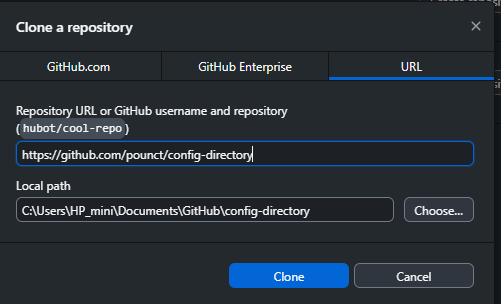
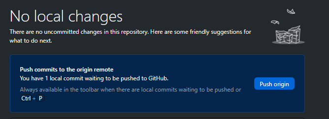
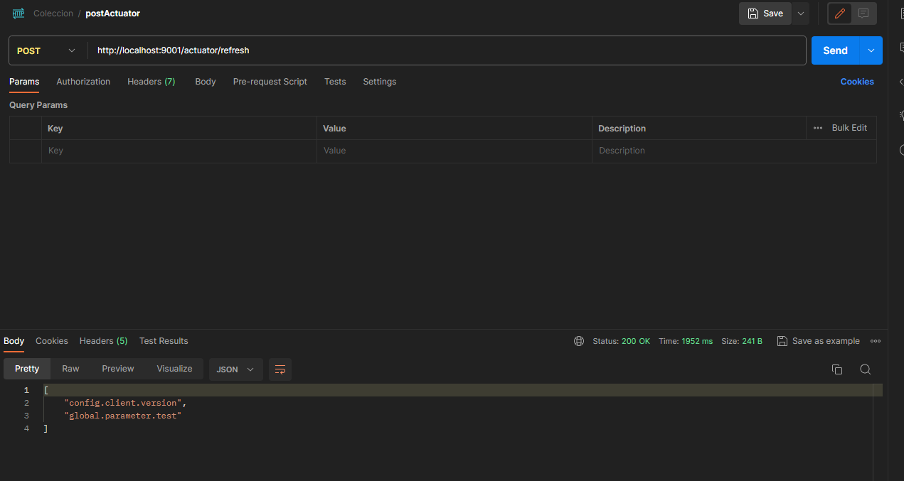

# CONFIG
How to centralize the configuration with spring-cloud-config server

create a config service
<pre>
  <code>
import org.springframework.boot.SpringApplication;
import org.springframework.boot.autoconfigure.SpringBootApplication;
import org.springframework.cloud.config.server.EnableConfigServer;

@SpringBootApplication
@EnableConfigServer
public class ConfigServerApplication {

	public static void main(String[] args) {
		SpringApplication.run(ConfigServerApplication.class, args);
	}

}
  </code>
</pre>

- add properties
	- server port
 	- application name
  	- directory of all configurations files
	  	- application.yml for globals configurations
	  	- service-name.yml for his specific config
  	  
<pre>
<code>
server:
  port: 8888
spring:
  application:
    name: config-server
spring:
  cloud:
    config:
      server:
        git:
          uri: https://github.com/pounct/CONFIG
</code>
</pre>

- We can use local directory using uri: file://C:/.../config-directory

- And start config server service (here port:8888)
- in consul :

  

- the service is in register service just with the dependency consul-discovery
- but we can enable discovery explicitment because in this version of consul
	is enable as default...
- for all service we need to register at consul discovery sevice with:

<pre>
  <code>
@EnableDiscoveryClient
  </code>
</pre>

<pre>
  <code>
import org.springframework.boot.SpringApplication;
import org.springframework.boot.autoconfigure.SpringBootApplication;
import org.springframework.cloud.config.server.EnableConfigServer;
import org.springframework.cloud.client.discovery.EnableDiscoveryClient;

@SpringBootApplication
@EnableConfigServer
@EnableDiscoveryClient
public class ConfigServerApplication {

	public static void main(String[] args) {
		SpringApplication.run(ConfigServerApplication.class, args);
	}

}
  </code>
</pre>

and we can consult ower configuration
samples:
<pre>
  <code>
	  http://localhost:8888/application/default
	  http://localhost:8888/challenge/default
	  http://localhost:8888/challenge/dev
	  http://localhost:8888/challenge/prod
  </code>
</pre>

- now that everything is fine
- we must indicate to each service where to look for its global and specific configuration (in our case: config_server)
- Before there was only the internal configuration "application.yml/.properties" and now in its local configuration there is a dependency towards an external one in our case the challenge service has the property:
<pre>
  <code>
server:
   port:9001
spring:
   application:
     name:challenge
   config:
     import:optional:configserver:http://localhost:8888
  </code>
</pre>

and to test that it is looking for its configuration from config_server we will create an endpoint with RestController as follows:
<pre>
  <code>
import org.springframework.beans.factory.annotation.Value;
import org.springframework.web.bind.annotation.GetMapping;
import org.springframework.web.bind.annotation.RestController;

import java.util.Map;

@RestController
public class ChallengeTestConfigRestController {
    @Value("${challenge.parameter.test}")
    private String challengeParameterTestConfig;
    @Value("${global.parameter.test}")
    private String globalParameterTestConfig;

    @GetMapping("/getParamsTest")
    public Map<String,String> myConfiguration(){
        return Map.of("global.parameter.test",globalParameterTestConfig,
                "challenge.parameter.test",challengeParameterTestConfig);
    }
}
  </code>
</pre>	  

when we use the values of the configuration file we use the @value annotation

# hot restart 
- or change parameters of configuration without restart a service:
- When changes are made to the configurations, the service receives its new configuration without restarting the service.
- I'm going to create a special GITHUB repository for the configuration and I'm calling it :
- "config-directory" and we'll make a few changes.

  
And I set the properties of config_server ..git.uri of course;

<pre>
  <code>
server.port=8888
spring.application.name=config-server
spring.cloud.config.server.git.uri=https://github.com/pounct/config-directory
  </code>
</pre>

- But that's not enough if we run the getConfigTest request we will see that the values have not changed.
- And this is where we need REFRESH from ACTUATOR by adding the @RefreshScope annotation to the config

<pre>
  <code>
import org.springframework.beans.factory.annotation.Value;
import org.springframework.cloud.context.config.annotation.RefreshScope;
import org.springframework.web.bind.annotation.GetMapping;
import org.springframework.web.bind.annotation.RestController;

import java.util.Map;

@RestController
@RefreshScope
public class ChallengeTestConfigRestController {

  </code>
</pre>

and don't forget to add the actuator endpoint refresh
* -> to see them all
but in our case we need "/actuator/refresh"

management.endpoints.web.exposure.include=*

<pre>
  <code>
server:
   port: 9001
spring:
   application:
     name: challenge
   config:
     import: optional:configserver:http://localhost:8888
management:
   endpoints:
     web:
       exposure:
         include: '*'

  </code>
</pre>

- now after these changes we start again.
- we make a change in the configuration
- and make a post POST (like postman client) To localhost:9001/actuator/refresh
- we can see just new version changed like:

  
  
And if we do a refresh page of the ../9001/getConfigTest we see the changes without needing to restart...
